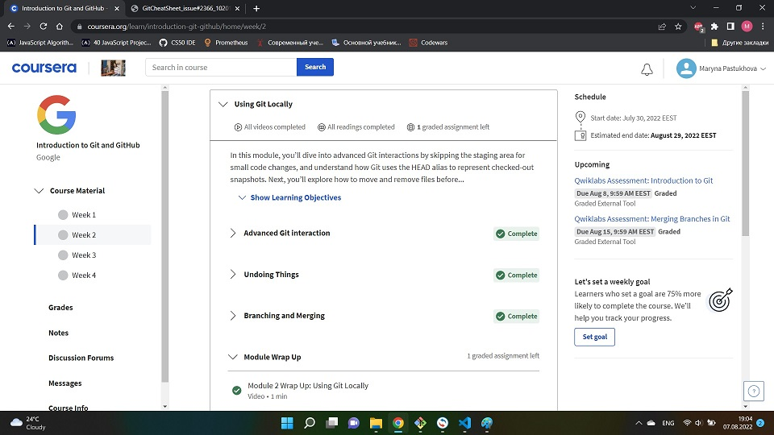
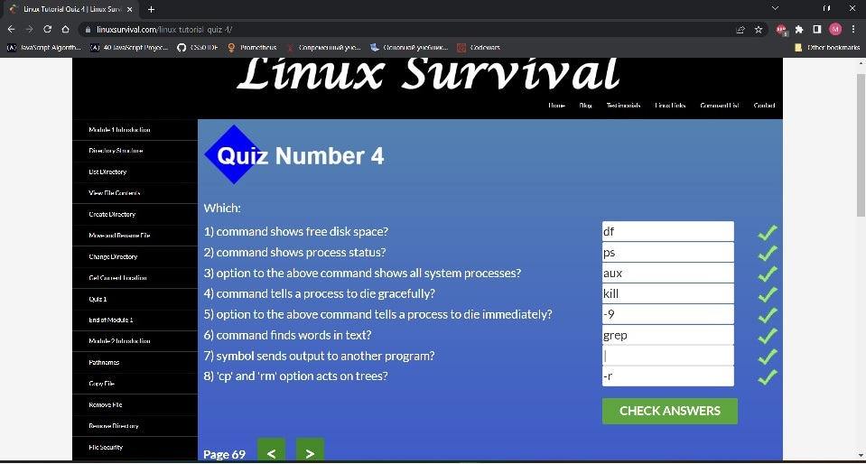
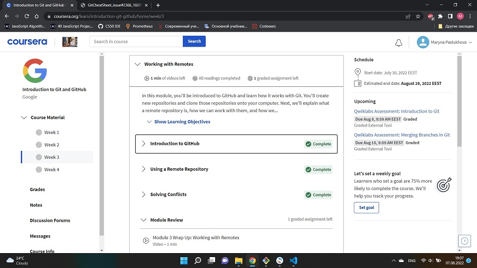
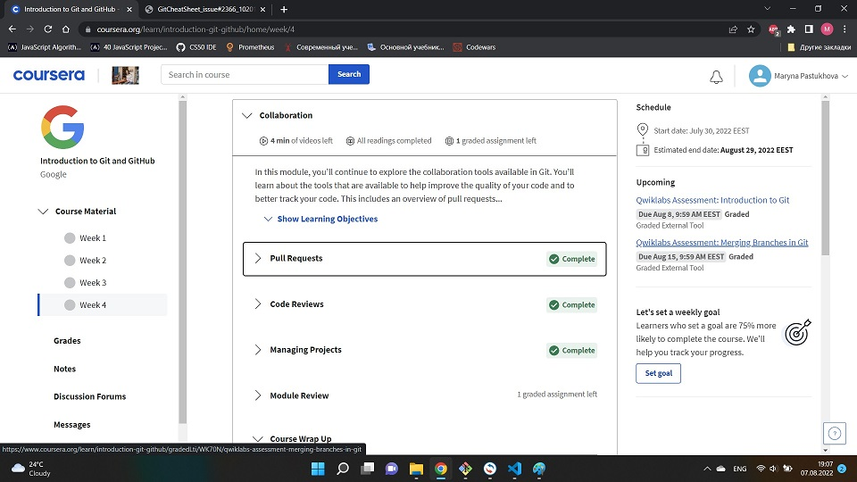

# kottans-frontend

## 0. Git Basics

Пройшла курс ["Version control with GIT"](https://www.udacity.com/course/version-control-with-git--ud123) на Udacity.

Потім 2 тижні ["Introduction to Git and GitHub"](https://www.coursera.org/learn/introduction-git-github/home/week/1) від Google. Це було моє перше знайомство з Git. Гадаю, добре, що почала саме з Udacity, там метеріал подають більш доступно і наочно.

Потім перейшла до [learngitbranching](https://learngitbranching.js.org/), дуже цікаво, ніби вчишся граючись. То була однозначно чудова задумка створити такий сайт) Загалом все зрозуміло. Поки що трохи плутаюсь, але, впевнена, що це через брак практики і з часом в голові все стане на місце.

## 1. Linux CLI, and HTTP

#### [Linux Survival (4 modules)](https://linuxsurvival.com/)

Курс [Linux Survival](https://linuxsurvival.com/) пройдено. Робила собі нотатки, щоб потім за необхідності легше було знайти потрібну інформацію. Перші два модуля пройшла швидко, особливих питань не виникло

Мабуть, єдине, що не дуже мені "пішло", це тема "Manual Pages" з 3 модуля. Поки що вона навряд мені знадобиться, а з часом розберусь.

Думала, що четвертий модуль буде найважчим і тут я застрягну, але ні, все було зрозуміло)

#### [HTTP: Протокол, який повинен розуміти кожний веб-розробник - Частина 1](https://code.tutsplus.com/uk/tutorials/http-the-protocol-every-web-developer-must-know-part-1--net-31177)

#### [HTTP: Протокол, який повинен розуміти кожний веб-розробник - Частина 2](https://code.tutsplus.com/uk/tutorials/http-the-protocol-every-web-developer-must-know-part-2--net-31155)

Зрозуміла принцип роботи цих протоколів, але статті ледь дочитала. Можливо,через брак візуалізації, інформація сприймається досить важко.

## 2. VCS (hello gitty), GitHub and Collaboration

#### Тижні 3 і 4 ["Introduction to Git and GitHub"](https://www.coursera.org/learn/introduction-git-github/home/week/3).

Новим для мене було абсолютно все)
Про Git/GitHub я знала лише в загальному і навіть не уявляла собі їхні масштаби і можливості.

#### Пройти наступні рівні на [learngitbranching](https://learngitbranching.js.org/)

Завершила всі рівні. В процесі ніби все ок, але згодом забувається, тому, думаю, що буду ще повератись до них.

